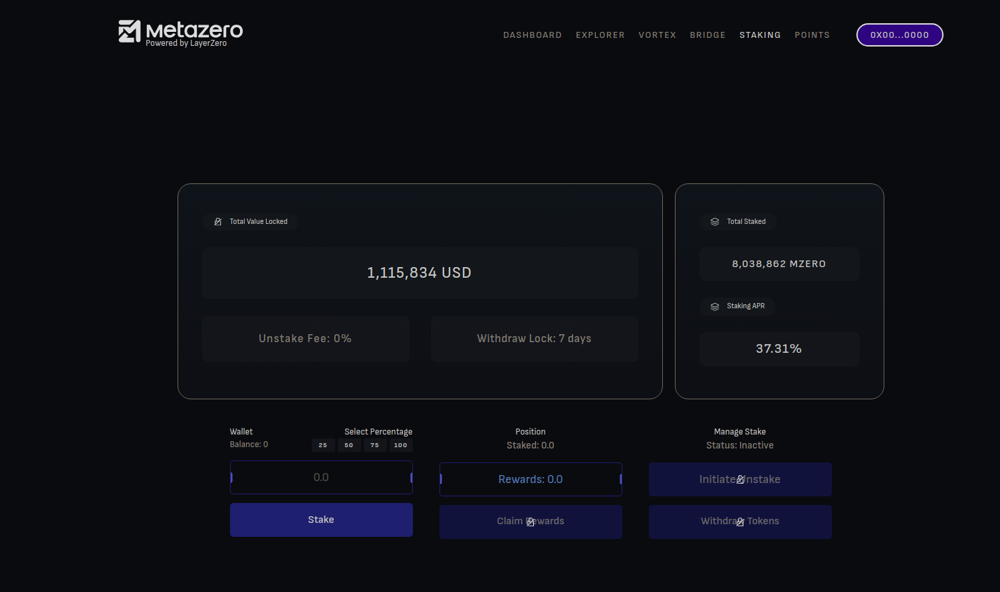
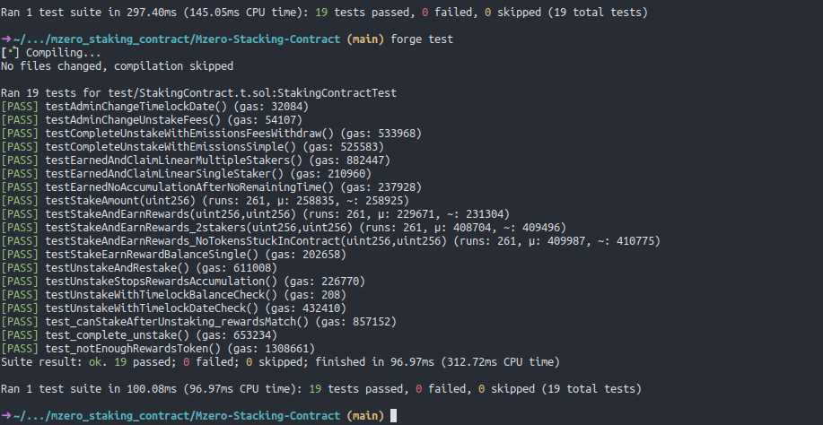

# MetaZero Staking Contract

A highly optimized ERC20 token staking platform with time-locked unstaking, configurable fee mechanisms, and precise reward distribution. Built with Solidity using the Foundry development framework.



## Project Overview

This project implements a robust staking contract that allows users to:

- Stake ERC20 tokens and earn rewards based on stake amount and duration
- Earn proportional rewards calculated with mathematical precision
- Initiate and complete unstaking with a configurable time-lock period
- Pay an optional unstaking fee (configurable up to 2%)

The implementation features a sophisticated reward distribution system that efficiently handles multiple stakers while maintaining high precision and gas efficiency.

## Technical Implementation

The project consists of two main contracts:

- **BasicToken.sol**: A standard ERC20 token implementation that serves as both the staking and reward token
- **StakingContract.sol**: The core staking mechanism with the following features:
  - Two-step unstaking process (initiate + complete) with time-lock
  - Linear reward emission over a configurable duration
  - Precise reward calculation using accumulated "reward per token" approach
  - Fee mechanism with admin configuration options
  - Protection against precision loss and fund locking

### Key Technical Features

- **Reward Calculation**: Implements a mathematically sound reward distribution algorithm that guarantees fair allocation regardless of when users join or leave the staking pool
- **Security Measures**: Uses OpenZeppelin's ReentrancyGuard to prevent reentrancy attacks
- **Access Control**: Implements Ownable pattern for privileged functions
- **Gas Optimization**: Carefully designed to minimize gas costs during staking and unstaking operations

## Security and Audits

The contract has undergone rigorous security audits by two reputable firms:

- **Assure DeFi Audit**: [View Report](https://github.com/Assure-DeFi/Audits/blob/main/METAZERO_ADVANCED_04_11_24.pdf)
- **ThreeSigma Audit**: [View Report](https://github.com/threesigmaxyz/publications/blob/main/audits/metazero-2/MetazeroStakingAudit.pdf)

These audits verified the contract's security, mathematical correctness, and resistance to common attack vectors. One minor precision loss issue (approximately 1 wei per staker) was identified and deemed acceptable.

## Testing

The contract includes comprehensive test coverage, addressing:

- Basic staking functionality
- Reward calculation accuracy
- Unstaking mechanics and timelock enforcement
- Multi-user interaction scenarios
- Edge cases and potential attack vectors



### Running Tests

```shell
$ forge test
```

## Installation and Usage

### Prerequisites

- [Foundry](https://book.getfoundry.sh/getting-started/installation)
- Ethereum wallet with testnet ETH (for deployment)

### Build

```shell
$ forge build
```

### Deployment

1. Add your wallet with the `cast` tool
2. Create an `.env` file in the root directory:
```
SEPOLIA_RPC_URL=
ETH_RPC_URL=
ETHERSCAN_API_KEY=
```
3. Deploy the token:
```shell
$ forge create ./src/BasicToken.sol:BasicToken --account $USER
```
4. Deploy the staking contract:
```shell
$ forge create src/StakingContract.sol:StakingContract --constructor-args $TOKENADDRESS 1000000000000000000 1711202960 259200 --account $USER
```
5. Verify the contract:
```shell
$ forge verify-contract --chain-id 11155111 --watch $TOKENADDRESS ./src/StakingContract.sol:StakingContract --constructor-args $(cast abi-encode "constructor(token,uint256,uint256,uint256)" $DEPLOYEDADDRESS 1000000000000000000 1711202960 259200)
```

## Development Insights

The staking contract was initially designed as a simple staking pool but evolved to meet additional requirements. The complexity introduced by these new features was carefully managed to maintain security and efficiency. The contract demonstrates advanced Solidity patterns and precise mathematical implementation for reward distribution.
